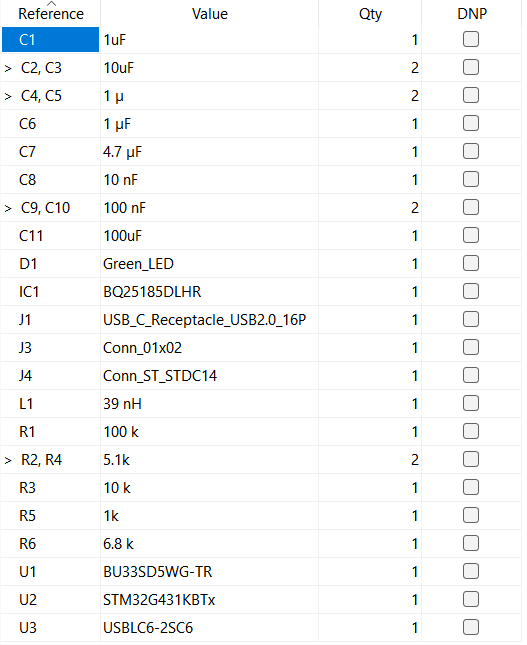
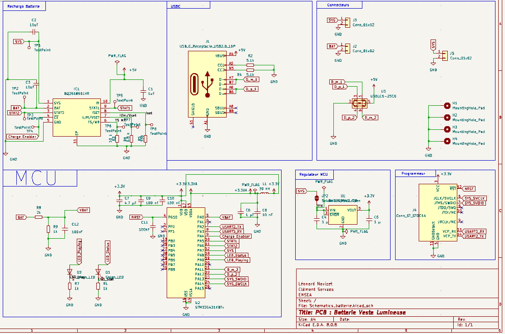
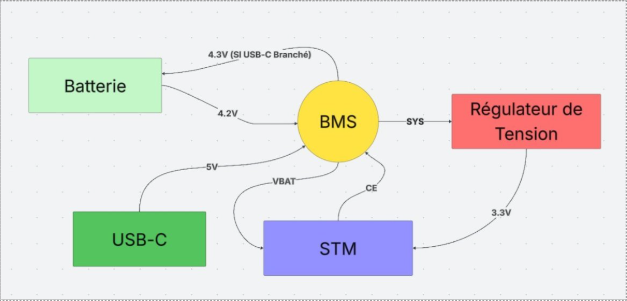
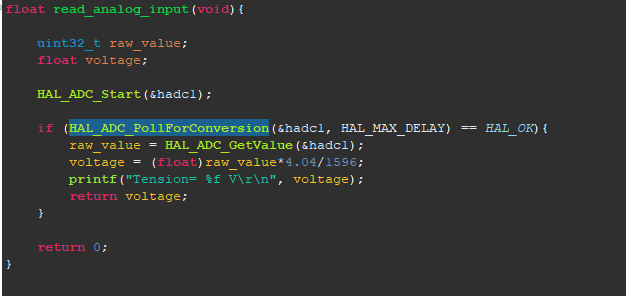

#Ce document est le readme pour la partie batterie de la veste lumineuse.

Elle est traitée par Clément Servaes et Léonard Navizet

## L'objectif de ce projet est de créer un PCB qui gère l'état de charge de la batterie ainsi que la distribution de la puissance vers les autres modules de la veste lumineuse.

##Explications des différents raisonnements et choix des composants:
Nous n'avons pas choisis nos composant actifs mais dimentioné nos composants passif.

Voici la bill of material qui est une liste des composants utilisés dans le projet :

Donc nous allons résumer le fonctiononement des composants utilisé et expliquer le choix des composants associé:
### 🟦 1. [STM32]
- **Référence :STM32G431KBTx**  
- **Fonction :Microcontroleur**  
- **Sert à commander l'ensemble de la carte.**

---

### 🟨 2. [BMS]
- **Référence :BQ25185DLHR**  
- **Fonction : Battery management system**  
- **Sert à mesurer l'état  de la batterie et dicte si la batterie doit se charger ou non**

---
### 🟩 2. [Régulateur de tension]
- **Référence :BU33SD5WG**
- **Fonction : Régule la tension a 3,3V**
- **Sert à réguler la tension SYS qui peut aller jusqu'a 5V**
---

# Après avoir choisi nos composants, on s'est dirigé vers kicad ou nous avons créer notre PCB. 

Nous avons commencé par déterminer tout les pins que notre STM32 aurait besoin pour la programmation des fonctionnalitées voulue, la gestion de la puissance d'alimentation et les LEDs de statut .
Nous avons ensuite configuré les éléments du programmeur. La prochaine étape a été de comprendre la documentation du composant BQ25185DLHR afin de savoir quelles entrées et sorties étaient nécessaires ainsi que la 
protections des voies de programmation. 

Nous avons enfin établi avec l'aide de notre encadrant la liste des composants nécessaire à l'inclusion d'un port USB-C. C'est pour cela que nous avons inclu le composant
USBLC6-2SC6 pour permettre au PCB de communiquer en USB-c avec l'ordinateur.

L'objectif est que la STM32 puisse recevoir les informations du BMS et puisse savoir si la carte est branchée en USB-C pour indiquer à l'utilisateur ((àl'aide de LEDs) et au BMS l'état de charge de la batterie et de la recharger si besoin est.

Voici un shéma fonctionnel.

# Codage de la STM32

Le code de la STM32 est composé en 2 paries. La première est une fonction qui lit la tension de la batterie et l'autre décide comment ragir.

Il faut tout d'abbord bien configurer tout les PINS correctement (VBAT et SYS réglé en ADC1 et 2 single-ended, CE et les 2 STAT en GPIO Output)

## Explication du code

La première étape est de lire la tension de la batterie.
Nous avons créer un utils.c avec la fonction read_analog_input codée ci-dessous.

La raw_value récupère la valeur envoyé par la STM. Nous avons mesuré la tension au même moment pour étalonner la variable voltage (4.04 V corresponds à 1596 au PIN).
Cela nous permet de mesurer la tension de la batterie et de l'afficher sur le terminal.

Il ne reste plus qu'à faire un rapide test logique (compte tenu de la tension de la batterie afin d'envoyer un 0 au charge Enabler si la batterie doit être chargée (Tension en dessous de 4 V) ou un 1 si cette dernière est suffisament chargée.

Il y a aussi une fonction qui permet dde signaler à l'utilisateur quand la charge de la batterie deviens critique. Dans ce cas, une LED rouge commencera clignotter.

